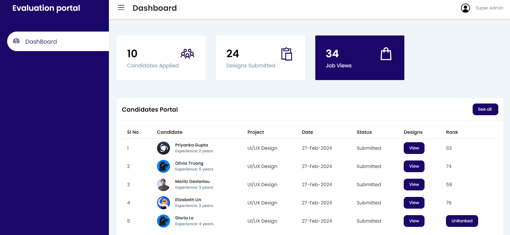
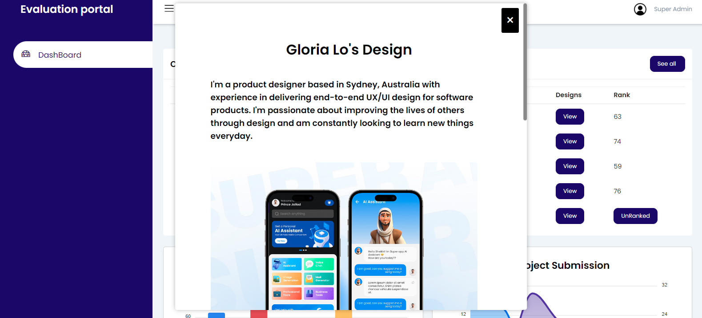
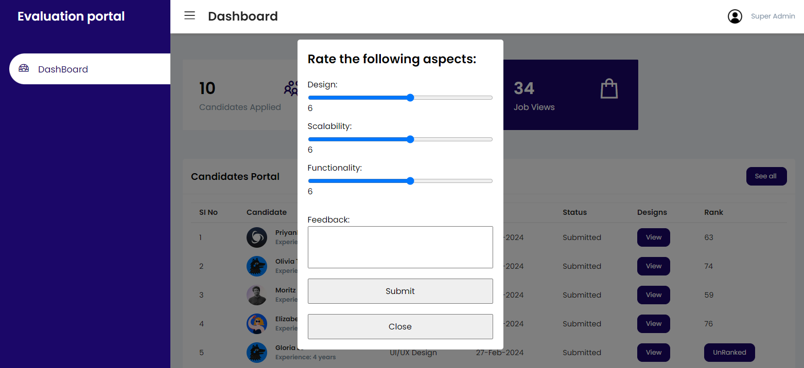
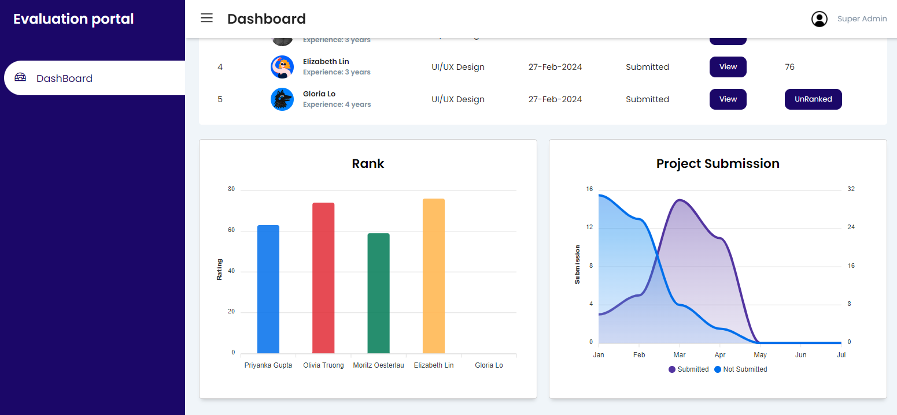
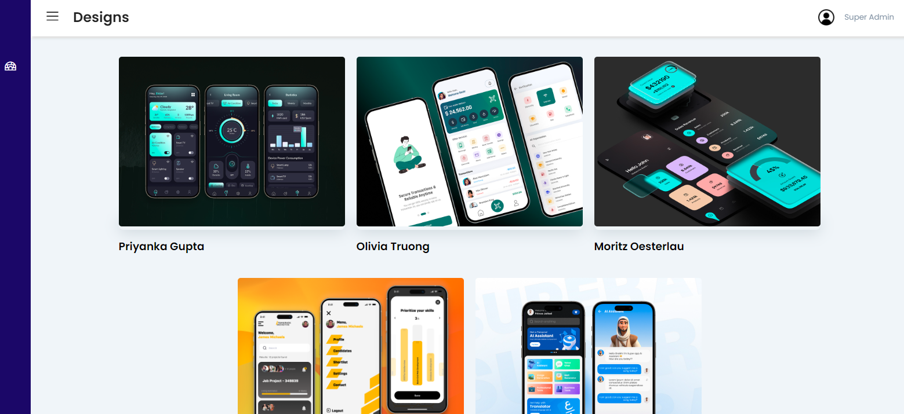

# UX Design portfolio Project with feedback and rating the candidates
### Responsive Mobile,PC,Tablet

- Responsive Website HTML CSS & JavaScript.
- Contains animations when scrolling.
- Smooth scrolling in each section.
- Developed first with the Mobile First methodology, then for desktop.

# Demo Links: https://main--dashboard-ranks-profile.netlify.app/

# Usage

Contains :Dashboard

# 1.) The Page Usage is to view the portfolio submitted by the job candidates.For Example :I have taken a concept UX design Portfolio of 5 people(if more needed it can be added)
# 2.) This site Allow the HR to view their portfolio and give ratings and feedback regarding to their portfolio.
# 3.) Once the rating is given,the review page will shows the ratings given to the job candidates.

# Guide(Help Notes)

# This is the landging page  

# View Portfolio

# Assesment Tools

# Graphs

# submitted Projects

